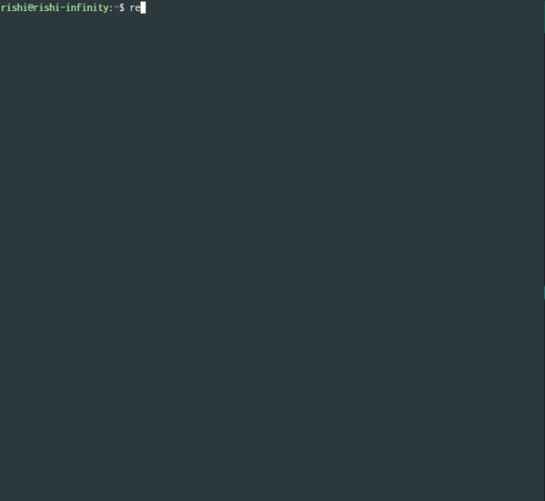

<h1 align="center">
	<br>
	
	<br>
	  
	<br>
</h1>

<p align="center"> <b> Search GitHub repositories from the command line! </b></p>

## Install

```
$ npm install --global repogit
```

## Usage

```
 Usage    : repogit <repository>
	  : repogit <repository> [commands]
	  : repogit <repository> [commands] <next-page>

 Commands :
  -search                     Normal search
  -best--match                Find the best match
  -most--stars                Find repositories with most stars
  -few--stars                 Find repositories with the least stars
  -most--forks                Find repositories with most forks
  -few--forks                 Find repositories with lest forks
  -recently--updated          Find recently updated repositories
  -least-recently--updated    Find least recently updated repositories

 Help     :
  $ repogit nodejs
  $ repogit google -most--stars
  $ repogit "twitter bot js" -search 2
  $ repogit "github bot" -recently--updated 3
```

## Preview

<p align="center"></p>

## License

MIT &copy; [Rishi Giri](http://rishigiri.ml)
